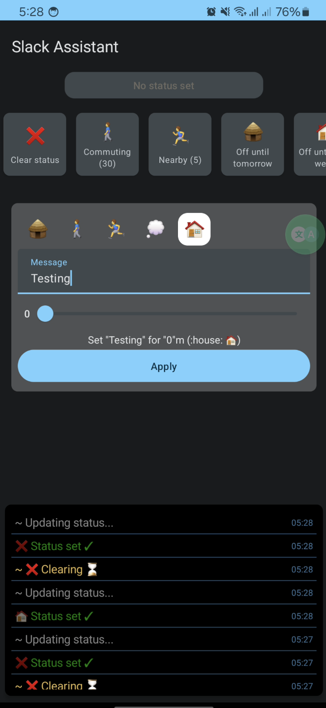

# Slack status assistant

> **Why is this created?**
> 
> At the moment I live 20m away from my office.
> I want to be able to set my slack status to "Working from home" when I'm in the street,
> so when I'm walking, I can set my status to help my coworkers see how close I am.
> 
> In the future, there could be some location detection and automatic status change. Who knows :)?



The project doesn't intend to follow any "clear architecture" patterns or ...,
instead I wanted to try new things and have some fun with functional approach in the project.  


**Features**:
- Multiple commands for different possible situations
- Console log

## How to use
- Clone this repo 
- Set your own slack token in your `local.properties` file
   ```yml
   userToken=YOUR_SLACK_TOKEN
   ```
- Run the app

## Future TODO
- [ ] Add snooze functionality
- [ ] Add set presence functionality
- [ ] Update future automated setter tasks
